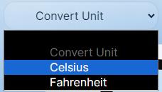

## Welcome
- Navbar<br/><br/>
<br/>
Select city from the provided options or select your current city by tapping the  icon.<br/><br/>



<br/><br/><br/>

- Weather data<br/><br/>
<br/>
It will show the weather data of the selected city.
<br/><br/><br/>

- Forecast<br/><br/>
<br/>
It will show the cards for next 14 days forecast.<br/>
Select the card according do the date you want weather data for.<br/>
<br/>
After selecting it will show the data of that date above.<br/>

<br/><br/><br/>

- Connect<br/><br/>
Click on the popover to get connect....<br/>


## Getting Started

First, run the development server:

```bash
npm run dev
# or
yarn dev
# or
pnpm dev
# or
bun dev
```

Open [http://localhost:3000](http://localhost:3000) with your browser to see the result.

You can start editing the page by modifying `app/page.js`. The page auto-updates as you edit the file.

This project uses [`next/font`](https://nextjs.org/docs/basic-features/font-optimization) to automatically optimize and load Inter, a custom Google Font.

## Learn More

To learn more about Next.js, take a look at the following resources:

- [Next.js Documentation](https://nextjs.org/docs) - learn about Next.js features and API.
- [Learn Next.js](https://nextjs.org/learn) - an interactive Next.js tutorial.

You can check out [the Next.js GitHub repository](https://github.com/vercel/next.js/) - your feedback and contributions are welcome!

## Deploy on Vercel

The easiest way to deploy your Next.js app is to use the [Vercel Platform](https://vercel.com/new?utm_medium=default-template&filter=next.js&utm_source=create-next-app&utm_campaign=create-next-app-readme) from the creators of Next.js.

Check out our [Next.js deployment documentation](https://nextjs.org/docs/deployment) for more details.
